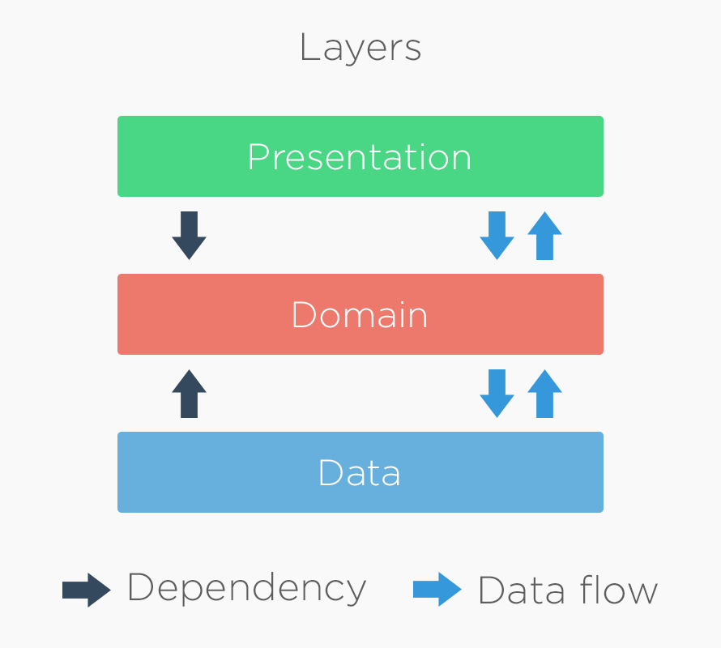

# Angular Clean Architecture

This repo aims to explain how to implement Clean Architecture in an Angular App

# What is Clean Architecture?


Clean Architecture is a design pattern that organizes code into layers, each with a specific responsibility. This helps in creating systems that are easy to maintain, test, and understand. The main layers are:

### Data Layer:

Handles data operations, such as fetching from databases or APIs.
Converts raw data into a format usable by the core layer.
Often includes repositories and data sources.

### Core Layer:

Contains the core business logic and rules.
Includes entities and use cases.
Independent of external systems, ensuring business rules are isolated from implementation details.

### Presentation Layer:

Manages the user interface and user interactions.
Converts user actions into calls to the core layer.
Displays data to the user, usually through views or components.
This structure ensures a clear separation of concerns, making the system easier to maintain, test, and scale.



## Main Folder structure

```
.
├── ...
├── app                     # Contains all app code
├── assets                  # Contains images and icons or any other asset files
├── environments            # Contains Angular environment files (optional)
├── styles                  # Contains Global styles of the app
└── ...
```

## App Folder structure

```
.
├── ...
├── app                     # Contains all app code
│   ├── features                   # Contains all features
│   │   ├── todos                               # todo feature which is the main feature of this app
│   │   │   ├── core                                    # Core or Domain Layer contains business logic
│   │   │   ├── data                                    # Data Layer contains data related files
│   │   │   ├── presentation                            # Presentation Layer contains UI related files
│   │   │   └── ...                              # Other files like module and routing for the feature
│   │   └── ...                              # Other features
│   ├── shared                     # Contains shared parts between all features & whole app
│   │   ├── components                       # Shared components, [used in multiple features]
│   │   ├── interceptors                     # App Interceptors
│   │   ├── utils                            # Shared Utilities for all features
│   │   └── ...                              # Other shared files like pipes, directives, ...
│   └── ...
└── ...
```

## Core Layer Folder structure

```
.
├── ...
├── core                     # Core Layer
│   ├── entities                    # entities
│   │   ├── todos.entity.ts                 # business logic for paginated list of todos
│   │   ├── todo.entity.ts                  # business logic for a todo
│   │   └── ...                             # Other entities
│   ├── repositories                # Repositories, [abstract classes]
│   │   ├── todos.repository.ts             # An abstraction of business logic, functionalities of the feature
│   │   └── ...                             # Other repositories
│   └── use-cases                   # Business logic use cases
│       ├── create-todo.use-case.ts         # use case of creating a todo
│       ├── update-todo.use-case.ts         # use case of updating a todo
│       ├── get-todo.use-case.ts            # use case of getting a todo
│       └── ...                             # Other use cases
└── ...
```

## Data Layer Folder structure

```
.
├── ...
├── data
│   ├── data-sources
│   │   ├── remote-todos.data-source.ts
│   │   └── ...
│   ├── repositories
│   │   ├── todos.repository-impl.ts
│   │   └── ...
│   └── models
│       ├── new-todo-request.dto.ts
│       ├── todo-response.dto.ts
│       ├── todos-response.dto.ts
│       └── ...
└── ...
```

## Presentation Layer Folder structure

```
.
├── ...
├── presentation
│   ├── components
│   │   ├── create-todo-dialog
│   │   ├── update-todo-dialog
│   │   ├── delete-todo-dialog
│   │   ├── todo-list
│   │   └── ...
│   ├── pages
│   │   ├── todo-details
│   │   ├── todos
│   │   └── ...
│   └── ...
└── ...
```

Clean Architecture offers several benefits for an Angular project, enhancing its structure, maintainability, and scalability. Here are some key benefits:

### 1. Separation of Concerns

Clean Architecture enforces a clear separation of concerns by dividing the project into different layers, such as presentation, domain, and data. Each layer has a specific responsibility:

Presentation Layer: Handles UI and user interactions (e.g., Angular components, services).
Domain Layer: Contains business logic and rules (e.g., use cases, domain models).
Data Layer: Manages data access and persistence (e.g., repositories, data sources).

### 2. Improved Testability

By isolating business logic in the domain layer and separating it from the UI and data layers, Clean Architecture makes it easier to write unit tests. You can test each layer independently, leading to more reliable and maintainable tests.

### 3. Flexibility and Maintainability

With a modular structure, Clean Architecture allows you to make changes in one part of the application without affecting others. This flexibility makes it easier to maintain and extend the project as requirements evolve.

### 4. Easier Refactoring

The clear separation between layers means that refactoring can be done with minimal impact on the overall system. For example, you can change the data source (e.g., switch from REST API to GraphQL) without modifying the business logic or presentation layers.

### 5. Scalability

Clean Architecture's modular approach facilitates scaling the application. As the project grows, new features can be added to specific layers without disrupting existing functionality.

### 6. Encapsulation and Abstraction

By using interfaces and abstract classes, Clean Architecture encapsulates implementation details and abstracts dependencies. This reduces coupling between components, making the system more robust and adaptable to change.

### 7. Enhanced Collaboration

A well-structured project with clear boundaries between layers improves collaboration among team members. Frontend developers can focus on the presentation layer, backend developers on the data layer, and business analysts on the domain layer.

### 8. Technology Agnostic

Clean Architecture is not tied to any specific technology or framework. This allows you to switch technologies (e.g., moving from Angular to React) without rewriting the entire application. Only the presentation layer needs to be adapted.

## Development server

Run `ng serve` for a dev server. Navigate to `http://localhost:4200/`. The application will automatically reload if you change any of the source files.

### This app uses [dummyjson](https://dummyjson.com/docs/todos) API
